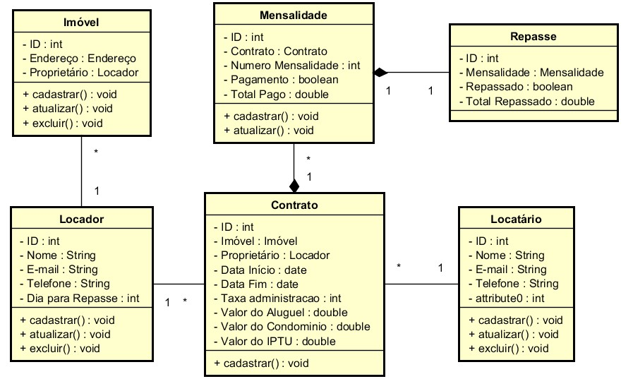

# Imobiliaria
Sistema para gestão de locações de uma imobiliária.

- Desenvolvido no linux (Linux Mint 19.4).
- Utilizei o Composer para gerar o Autoload das classes de acordo com a PSR-4.
- No front-end utilizei apenas o bootstrap (versão 3.3.7 - arquivo incluído na pasta css)
- Arquivo .htaccess na pasta www para criar URLs amigáveis.

# [Requisitos necessários](#requisitos)
- Docker e docker-compose
- PHP 7.4

# [Como rodar o projeto](#rodar-o-projeto)
- Execute os comandos abaixo:
  ```sh
  git clone https://github.com/rafaelgalvan/imobiliaria.git
  ```
    (clone do projeto)
    
  ```sh
  docker-compose up -d
  ```
    (esse comando irá baixar as imagens utilizadas no projeto, caso seja a primeira vez que seja invocado, e inicializar os containers da aplicação)
    
  ```sh
  docker run --rm -v $(pwd)/www/app:/app composer update
  ```
    (Esse comando irá gerar os arquivos de autoload do projeto)

- Importe para a base de dados o aquivo imobiliaria.sql

# [Para rodar o projeto no browser, use as portas abaixo:](#rodar-no-browser)

| Server     | Port |
|------------|------|
| MySQL      | 8989 |
| PHPMyAdmin | 8080 |
| Apache     | 8000 |

Exemplo: acesse http://localhost:8000 para abrir a página inicial da aplicação, hospedada no servidor Apache.

- Banco de dados (acesso via PHPMyAdmin http://localhost:8080)
  | usuario | senha |
  |---------|-------|
  | root    | root  |

# [Estrutura do Projeto](#estrutura)

```sh
.
├── data
│   └── db
│       ├── dumps
│       └── mysql
├── Dockerfile
├── README.md
├── .env
├── .gitignore
├── docker-compose.yml
└── www
    ├── app
    │   ├── composer.json.dist
    │   ├── phpunit.xml.dist
    │   ├── src
    │   │   ├── Controller
    │   │   ├── Lib
    │   │   ├── Model
    │   │   └── View
    │   ├── vendor
    │   ├── composer.json
    │   └── composer.lock
    ├── assets
    │   ├── css
    │   └── js
    │
    ├── .htaccess
    └── index.php
```

# [Diagrama de Classes](#diagrama)


